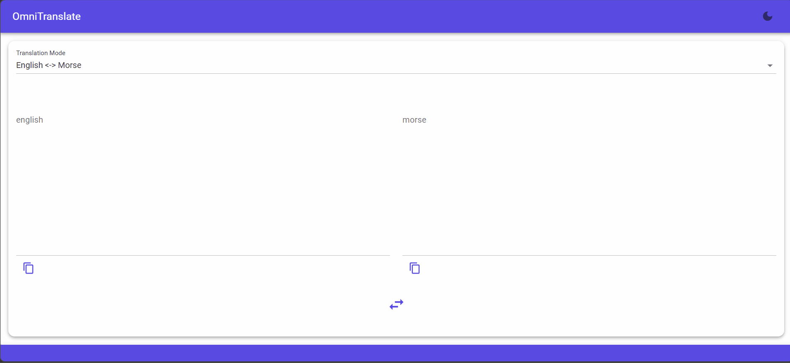

# OmniTranslate – Blazor + Prolog Language Converter With AI Assistant

OmniTranslate is a **Blazor** application using **MudBlazor** for the UI, **Prolog** for rule‑based translation, and optional **Azure OpenAI agent assistance**. 
It supports both fictional and symbolic languages, specifically, **Tibia Orc**, **Minion**, **Morse**, and **Braille**.

The system supports:

- Multi‑word expressions  
- Punctuation preservation
- Line‑break preservation  
- Bidirectional translation  
- Modular translator architecture  
- Prolog‑powered dictionaries
- AI assistant via Azure OpenAI



---

## 📑 <a name="toc">Table of Contents

1. [Overview](#overview)  
2. [Features](#features)  
3. [Folder Structure](#folder-structure)  
4. [Usage Examples](#usage-examples)
5. [How It Works](#how-it-works)  
6. [Adding New Languages](#adding-new-languages)
7. [Setup AI Assistant help via Azure OpenAI](#setup-ai-assistant)
8. [Requirements](#requirements)  
9. [Contact](#contact)

---

## 🧭 <a name="overview">Overview

OmniTranslate is a Blazor application that converts text **from one language to another** using **Prolog rules**.  
Each language pair is implemented as a translator class that loads a `.pl` dictionary and performs token‑based translation.

This project is ideal for:

- Game language converters  
- Fictional language experiments  
- Prolog‑powered linguistic tools  
- Educational demos mixing C# and logic programming  

[Back to Table of contents](#toc)

---

## ✨ <a name="features">Features

- ✔️ Blazor UI with dynamic text areas  
- ✔️ Prolog‑based dictionaries (`orc.pl`, `minion.pl`, etc.)  
- ✔️ English → Orc and Orc → English  
- ✔️ English → Minion and Minion → English  
- ✔️ Multi‑word expression support  
- ✔️ Punctuation‑safe translation  
- ✔️ Newline preservation (`\n`, `\r\n`)  
- ✔️ Modular translator interface (`ITranslator`)  
- ✔️ Easy to extend with new languages  

[Back to Table of contents](#toc)

---

## 📁 <a name="folder-structure">Folder Structure

```
  OmniTranslate-BlazorProlog/                               # Main repository
    │
    ├── LICENSE                                             # MIT license
    ├── README.md                                           # Project documentation
    │
    └── src/                                                # Application source code
		│
		├── OmniTranslate-BlazorProlog.Tests/
		│   ├── AiChatServiceTests.cs                           # Tests for AI chat service
		│   └── PrologTranslationServiceTests.cs                # Tests for Prolog translation service
		│
		└── OmniTranslate-BlazorProlog/
			│
			├── wwwroot/                                          # Static web assets
			│   │
			│   ├── app.css                                       # Global stylesheet
			│   │
			│   └── js/                                           # JavaScript utilities
			│       ├── clipboard.js                              # Clipboard helper for copy buttons
			│       └── screen.js                                 # Auto-resize and UI utilities
			│
			├── Components/                                       # Blazor UI components
			│   │
			│   ├── _Imports.razor                                # Shared Razor imports
			│   ├── App.razor                                     # Blazor application root
			│   ├── Routes.razor                                  # Application routing
			│   │
			│   ├── Layout/                                       # Application layout components
			│   │   ├── MainLayout.razor                          # Main layout wrapper
			│   │   └── ReconnectModal.razor                      # Connection recovery UI
			│   │
			│   ├── Pages/                                        # Route-level pages
			│   │   ├── Error.razor                               # Error page
			│   │   ├── NotFound.razor                            # 404 page
			│   │   └── TranslatorPage.razor                      # Main translation interface
			│   │
			│   ├── Translator/                                   # Components used by TranslatorPage
			│   │   ├── CopyButton.razor                          # Copy-to-clipboard button
			│   │   ├── LanguageSelector.razor                    # Dropdown for selecting translation mode
			│   │   └── TranslationPanel.razor                    # Input/output text areas
			│   └── Shared/                                       # Shared components
			│       └── ChatPanel.razor                           # AI chat assistant panel    
			│
			├── Models/
			│   └── TranslationMode.cs                            # Enum/model defining translation modes
			│
			├── Prolog/                                           # Prolog dictionaries
			│   ├── braille.pl                                    # Braille dictionary
			│   ├── minion.pl                                     # Minion dictionary
			│   ├── morse.pl                                      # Morse dictionary
			│   └── orc.pl                                        # Orc dictionary
			│
			├── Services/                                         # Application services
			│   │
			│   ├── TranslationModeProvider.cs                    # Provides active translation mode
			│   ├── TranslationRegistry.cs                        # Registers available translators
			│   │
			│   ├── Implementations/                              # Concrete service implementations
			│   │   │
			│   │   ├── Translators/                              # C# translators (English <-> X)
			│   │   │   ├── BrailleToEnglishTranslator.cs         # Braille → English
			│   │   │   ├── EnglishToBrailleTranslator.cs         # English → Braille
			│   │   │   ├── EnglishToMinionTranslator.cs          # English → Minion
			│   │   │   ├── EnglishToMorseTranslator.cs           # English → Morse
			│   │   │   ├── EnglishToOrcTranslator.cs             # English → Orc
			│   │   │   ├── MinionToEnglishTranslator.cs          # Minion → English
			│   │   │   ├── MorseToEnglishTranslator.cs           # Morse → English
			│   │   │   └── OrcToEnglishTranslator.cs             # Orc → English
			│   │   │
			│   │   ├── AIChatService.cs                          # AI chat service
			│   │   └── PrologTranslationService.cs               # Executes Prolog queries
			│   │
			│   └── Interfaces/                                   # Interfaces and abstractions
			│       │
			│       ├── IAIChatService.cs                         # AI chat interface        
			│       ├── IPrologTranslationService.cs              # Interface for Prolog execution service
			│       └── ITranslator.cs                            # Base interface for all translators
			│
			├── appsettings.json                                  # Application configuration
			├── appsettings.Development.json                      # Development environment config
			└── Program.cs                                        # Application entry point
```

[Back to Table of contents](#toc)

---

## 🧪 <a name="usage-examples">Usage Examples

Below are simple examples showing **input** and **expected output** for each translator.

###  🗣️ English ↔ 🧌 Orc

🗣️

Hi, warrior! Buy a weapon.

🧌

charach, warrior! goshak a porack.

### 🗣️ English ↔ 🍌 Minion

🗣️ 

Hello, friend!

🍌

bello, friend!

### <a name="english--morse"> 🗣️ English ↔ • — Morse 

🗣️

SOS

• — 

... --- ...

### <a name="english--braille"> 🗣️ English ↔ 📘 ⠿ Braille  

🗣️

cat

📘 ⠿

⠉ ⠁ ⠞

[Back to Table of contents](#toc)

---

## ⚙️ <a name="how-it-works">How It Works

OmniTranslate combines **Blazor**, **C#**, and **Prolog** to perform structured, rule‑based text translation.  
Each language pair is implemented as a translator that loads a Prolog dictionary and applies token‑level processing.

### 🧠 Translator Classes

Each language pair in OmniTranslate is implemented as a dedicated translator class.  
All translators implement the shared `ITranslator` interface, ensuring a consistent structure and making it easy to add new languages.

A translator is responsible for:

- Loading its Prolog dictionary (`.pl` file)
- Tokenizing input text into words, punctuation, and line breaks
- Preserving formatting such as `\n`, `\r\n`, and punctuation
- Querying Prolog for translations
- Reassembling the final output

This modular design allows each language to define its own rules while keeping the translation pipeline unified.

### 🖥️ Blazor UI

The Blazor interface provides a clean and responsive environment for interacting with the translators.

Key UI features include:

- Two translation panels (input and output)
- Auto‑resizing text areas
- Copy‑to‑clipboard buttons
- Real‑time translation as you type
- A dropdown menu for selecting the translation direction

The UI simply forwards text to the selected translator and displays the result.

### 📚 Prolog Dictionaries

Each supported language has a dedicated `.pl` file located in the `/Prolog/` directory.

Example (Orc dictionary):

```prolog
orc_word("hi", "charach").
orc_word("sword", "burkabata").
orc_word("buy", "goshak").
```

Dictionaries may contain:

- Single‑word mappings
- Multi‑word expressions
- Special cases or idioms
- These rules are queried directly by the C# translators.

[Back to Table of contents](#toc)

---

## ➕ <a name="adding-new-languages">Adding New Languages

OmniTranslate is designed to be easily extensible.  
The following steps are required add a new language.

### 📄 Create a Prolog Dictionary  
Add a new file under `/Prolog/`:
```
mynewlang.pl
```

Define translation rules:

```prolog
mynewlang_word("hello", "xyz").
mynewlang_word("friend", "abc").
```

### 🧠 Create Two Translators  
Add the following C# classes:

- `EnglishToMyNewLangTranslator.cs`
- `MyNewLangToEnglishTranslator.cs`

Both must implement the shared `ITranslator` interface and load your new `.pl` dictionary.  
This ensures the new language integrates seamlessly with the existing translation pipeline.
After this step, your new language becomes fully available in the application.

[Back to Table of contents](#toc)

---

## 🤖 <a name="setup-ai-assistant">Setup AI Assistant help via Azure OpenAI

OmniTranslate supports an optional AI Assistant powered by Azure OpenAI.
This assistant can provide:
- Clarifications
- Suggestions
- Fallback translations
- Natural‑language explanations

To enable AI assistance, you must configure an Azure OpenAI resource.

### 📘 Create an Azure OpenAI Resource

Follow Microsoft’s official guide to create the resource and deploy a model: 
[AI: Create an Azure OpenAI Resource and Deploy a Model](https://learn.microsoft.com/en-us/microsoft-cloud/dev/tutorials/openai-acs-msgraph/02-openai-create-resource)

During this process, you will obtain:
- Your Azure OpenAI endpoint URL
- Your API key
- Your model deployment name
- The API version to use

You will need these values in the next step.

### 🛠️ Configure `appsettings.{environment}.json`

Once you have your Azure OpenAI resource, add the following section to your environment‑specific settings file:
```
"AzureOpenAI": {
  "Endpoint": "https://YOUR-RESOURCE-NAME.openai.azure.com/",
  "ApiKey": "YOUR-AZURE-OPENAI-KEY",
  "Deployment": "YOUR-MODEL-DEPLOYMENT-NAME",
  "ApiVersion": "2024-02-15-preview"
}
```

Field explanations
- Endpoint: The base URL of your Azure OpenAI resource.
- ApiKey: The access key generated by Azure.
- Deployment: The name of the model deployment you created (e.g., gpt-4o-mini, gpt-4o, etc.).
- ApiVersion: The API version required for your deployment.

After this step, your AI Assistant is now available in the application.

[Back to Table of contents](#toc)

---

## 🧩 <a name="requirements">Requirements

To run OmniTranslate, you will need:

- **.NET 10**  
- **Blazor WebAssembly or Blazor Server**  
- **Prolog.NET engine** (for executing `.pl` dictionaries)  
 Prolog engine for .NET — OmniTranslate uses the
[CSharpProlog](https://github.com/jsakamoto/CSharpProlog/tree/vnext/master) (vNext) engine by jsakamoto  
to execute .pl dictionary files
- A modern browser (Chrome, Edge, Firefox, Safari)
- The Azure OpenAI endpoint URL and API key, which you obtain after creating an Azure OpenAI resource and deploying a model.
Follow Microsoft’s guide here: [AI: Create an Azure OpenAI Resource and Deploy a Model](https://learn.microsoft.com/en-us/microsoft-cloud/dev/tutorials/openai-acs-msgraph/02-openai-create-resource)

Optional for development:

- Visual Studio 2022 or VS Code  
- Git  
- Node.js (if extending frontend tooling)

[Back to Table of contents](#toc)

---

## 📬 <a name="contact">Contact & Usage Notice

OmniTranslate is released under the MIT License, which allows you to freely use, modify, distribute, and build upon the project — including creating your own translators, dictionaries, demos, extensions, or integrating it into other applications.

Please keep the following in mind:

- You may not claim authorship of OmniTranslate or its built‑in translators.
- If you extend the system, create new language packs, build tools on top of it, or port it to another platform or programming language, I kindly ask that you let me know. I genuinely enjoy seeing how the project evolves and how others build upon it.

For full legal details, please refer to the **[LICENSE](https://github.com/g-amador/OmniTranslate-BlazorProlog/blob/master/LICENSE)** file included with the project.

If you have questions, suggestions, or want to share your work, feel free to reach out:

📧 **[g.n.p.amador@gmail.com](mailto:g.n.p.amador@gmail.com)**

Good luck, and have fun building with OmniTranslate!

[Back to Table of contents](#toc)

---

> Built with ❤️, .NET, Prolog… and a sprinkle of Copilot magic.
